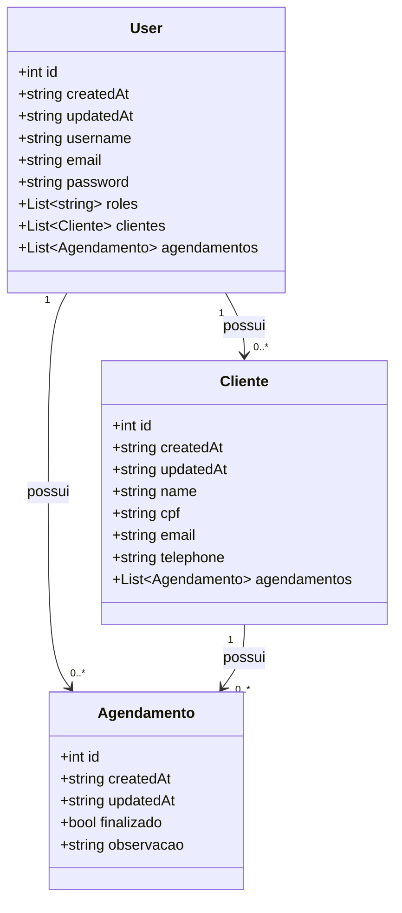

# Agendamento Manicure
Java Restful API criada By Matheus Hardman -> 2025

## Diagrama de classes

```mermaid
classDiagram

%% Classe principal: User
class User {
  +int id
  +string createdAt
  +string updatedAt
  +string username
  +string email
  +string password
  +List~string~ roles
  +List~Cliente~ clientes
  +List~Agendamento~ agendamentos
}

%% Classe Cliente
class Cliente {
  +int id
  +string createdAt
  +string updatedAt
  +string name
  +string cpf
  +string email
  +string telephone
  +List~Agendamento~ agendamentos
}

%% Classe Agendamento
class Agendamento {
  +int id
  +string createdAt
  +string updatedAt
  +bool finalizado
  +string observacao
}

%% Relações
User "1" --> "0..*" Cliente : possui
User "1" --> "0..*" Agendamento : possui
Cliente "1" --> "0..*" Agendamento : possui
```
